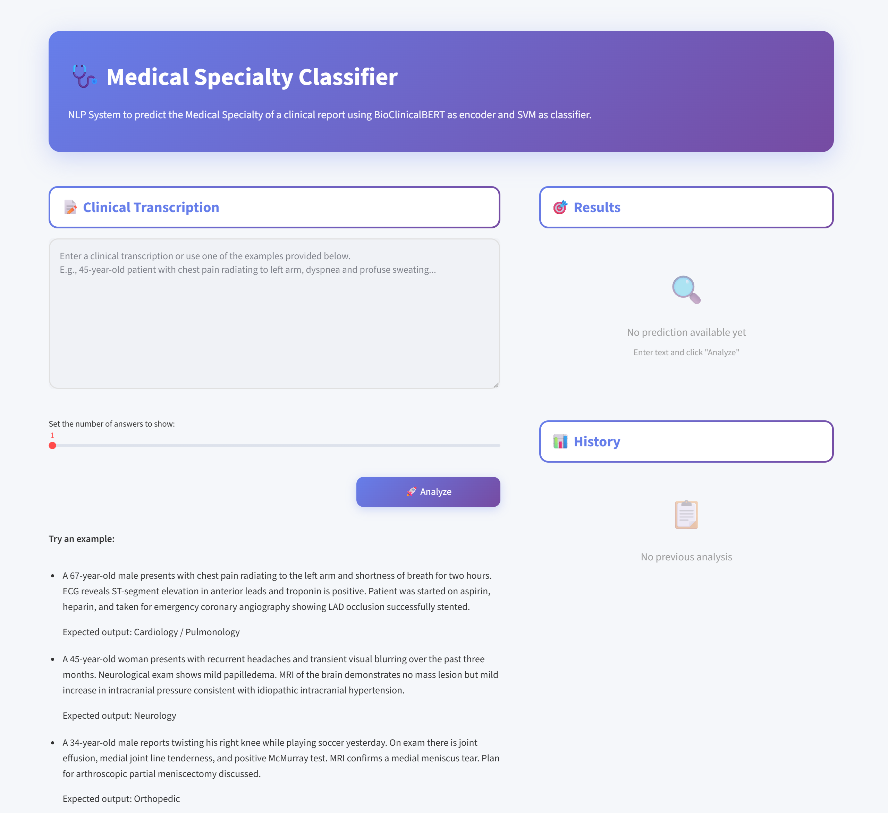
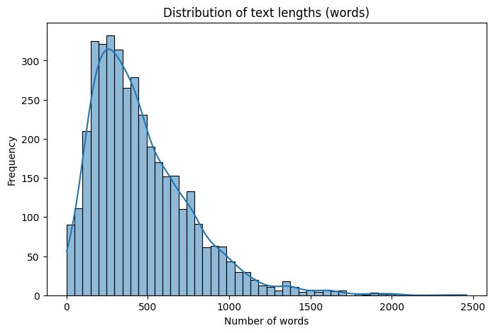
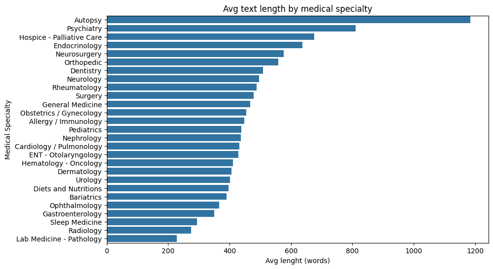
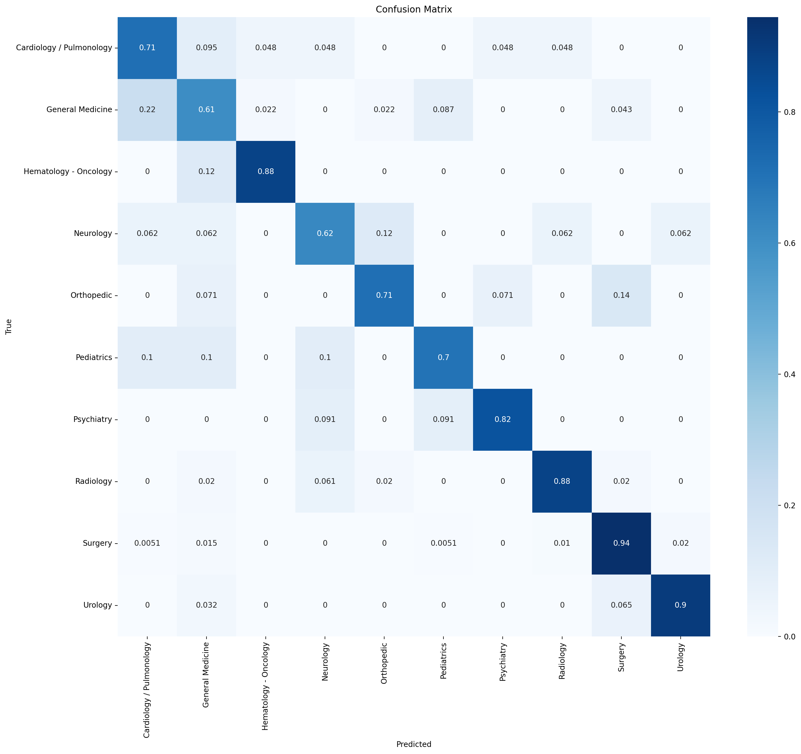

# 🧠 Medical Specialty Classifier

A Natural Language Processing system for predicting the **medical specialty** of a clinical transcription.
The model uses a domain-specific encoder and a lightweight classifier to assign each note (e.g., surgery report, radiology exam, discharge summary) to its correct specialty.

---

## 📘 Dataset

The model is trained and evaluated on the [**Medical Transcriptions Dataset**](https://www.kaggle.com/datasets/tboyle10/medicaltranscriptions/data),
which contains 2,000+ real-world medical dictations across dozens of specialties.

Each record includes fields such as:
- `medical_specialty` — target label (e.g., *Surgery*, *Radiology*, *Neurology*)
- `transcription` — free-text report
- `description` and `keywords` — brief metadata used in preprocessing

Most clinical transcriptions have a length between **200 and 500 words**, with a long tail of more extensive notes.

It is noted that transcriptions for specialties such as **Autopsy**, **Psychiatry**, and **Hospice - Palliative Care** tend to be significantly longer, averaging near or over **800 words**. Conversely, specialties like **Lab Medicine - Pathology** and **Radiology** have texts that are shorter on average.

---

## ⚙️ Project Overview

| Component | Description |
|------------|-------------|
| **Dataset preprocessing** | Cleans text, merges transcription with description/keywords, and filters rare classes. |
| **Encoder** | [/Bio_ClinicalBERT](https://huggingface.co/emilyalsentzer/Bio_ClinicalBERT), a domain-tuned transformer for clinical text. |
| **Classifier** | SVM with linear kernel. |
| **Frameworks** | 🤗 `transformers`, `scikit-learn`, `fastapi`, `uvicorn`, `joblib`. |
| **Artifacts** | Encoder name, trained classifier, and label list are saved under `artifacts/`. |
| **API** | RESTful interface built with FastAPI. |

### 📊 Model Summary
| Metric | Score |
|--------|--------|
| **Accuracy** | 0.851 |
| **Macro F1** | 0.759 |
| **Weighted F1** | 0.853 |

Given an input text, the model returns a **ranked list of predicted specialties**, ordered by decreasing confidence.
The model performs strongly on frequent classes such as *Surgery*, *Radiology*, and *Urology*, and maintains reasonable generalization on smaller classes like *Pediatrics* or *Orthopedic*.
The confusion matrix illustrates the model's ability to correctly classify each specialty.

Example:
Input: "A 34-year-old male with knee effusion, medial joint line tenderness, positive McMurray..."
Output: ["Orthopedic", "Surgery", "Radiology"]

## 🚀 Following
Next step: integrate the model with a FastAPI interface to make it accessible on a custom interface.
